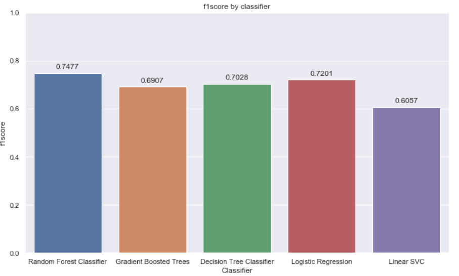
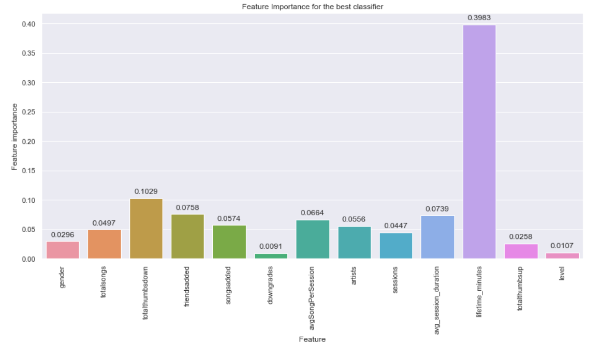

# UdacityDSND-Capstone Project: Sparkify
This code was written under the Udacity Data Scientist Nanodegree Project.
Capstone Project - Sparkify

## Table of Contents

1. [Installation](#Installation)
2. [Introduction/Motivation](#Introduction)
3. [Data](#Data)
4. [Results](#Results)
5. [Licensing, Authors, and Acknowledgements](#Licensing)

## Installation <a name="Installation"></a>
* The code was developed and tested on anaconda with python 3.73. Nevertheless, it should run with no issues using Python 3.* in any other environment.
* The dataset (tiny subset) is included in this rep.
* Libraries needed:
  * PySpark;
  * Pandas;
  * Seaborn 0.9+;
  * Matplotlib.

## Introduction / Motivation <a name="Introduction"></a>
This is an Udacity Data Science Nanodegree project.

#### Intro
Sparkify is a music streaming service (similar to Apple Music and Spotify), and can be used for free, or if the customer wants there are also paid plans which eliminate advertising.

The data provided is the log of the users interactions with the service/application. Every event/interaction is recorded with the following information:


 
This project has 4 main stages:
1. Loading and cleaning data
    1. Load dataset
    2. Cleaning missing or invalid data
2. Exploratory Data Analysis
    1. Define Churn & Downgrades from the original features
    2. Explore data (analysing interactions from both type of users: those who churned and those who didn't)
3. Feature Engineering
    1. Build meaningful features from the original dataset for each user, that represent the overall experience in Sparkify
    2. Save final dataset with engineered features
4. Model training and Prediction
    1. Split data into training and testing data sets
    2. Train several classification models & Hyperparameter tunning with Grid Search
    3. Select best machine learning model based on f1score

In this project I'll be using Spark (PySpark) for all the data manipulation, loading, cleaning, feature engineering and Machine Learning.
This workspace contains a tiny subset (128MB) of the full dataset available (12GB). This workspace is used to build the project, or to explore a smaller subset with Spark. The code can then be deployed on the cloud.


#### Problem Definition

The aim of this project is to predict customer churn based on its usage history/log. For that purpose it will be needed to generate new meaningful features that characterize user experience in Sparkify, so that we can use a machine learning model to predict which customers are likely to churn.

For the prediction part I'll be using use F1 score to select the best machine learning model since the churned users are a fairly small subset (highly imbalanced dataset).
   
## Data <a name="Data"></a>
```text
UdacityDSND-CapstoneSparkify/
├── Sparkify.ipynb
├── data_final_spark.csv.zip
├── mini_sparkify_event_data.zip
├── Sparkify.html
```
* __Sparkify.ipynb__: Notebook with all the scripts used to analyse data and to address the churn prediction problem
* __data_final_spark.csv.zip__: final data set after feature engineering (in spark format) - must be unzipped!
* __mini_sparkify_event_data.zip__: tiny subset (128MB) of the full dataset available (12GB) - must be unzipped!
* __Sparkify.html__: .html version of the jupyter notebook

## Results <a name="Results"></a>
The detailed analysis and main conclusions/results are availabe in [here](https://medium.com/@luisf.almeida90/dont-let-them-go-sparkify-82eb422379f1).

* Model Training with Hyperparameter Tuning with Grid Search - outcome




| Classifier                | Accuracy  | f1score  | Time      |
| ------------------------- |:---------:|:--------:| ---------:|
| Random Forest Classifier  | 0.777778  | 0.747710 | 50.091728 |
| Gradient Boosted Trees    | 0.740741  | 0.690657 | 95.441571 |
| Decision Tree Classifier  | 0.722222  | 0.702811 | 56.105295 | 
| Logistic Regression       | 0.759259  | 0.720124 | 63.920029 |
| Linear SVC                | 0.722222  | 0.605735 | 47.068066 |


The best classifier seems to be _Random Forest_, which achieved ~**78% accuracy** and **0,75 f1 Score**. 


* Main factors influencing price - feature importance



When looking at the feature importance, the _lifetime_ stands out meaning it has a really important role in whether the user is prone to churn or not. The second most relevant feature is _Thumbs down_ which might be easier to understand since higher number of thumbs down might indicate the user is not satisfied with the songs that are being suggested by the application.


## Licensing, Authors, and Acknowledgements <a name="Licensing"></a>
* Thanks to Udacity for all the useful insights and interesting challenges!
